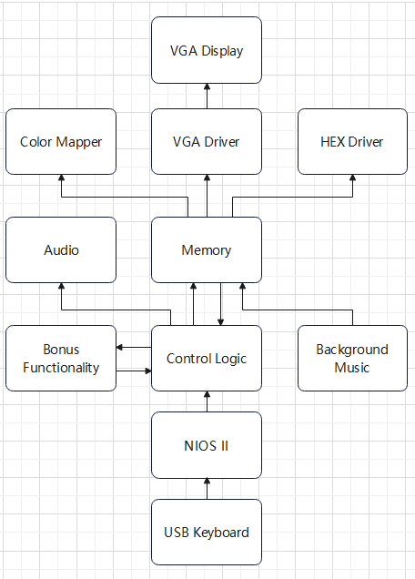

# **ECE 385 Final Project Proposal: FPGA-Based Tetris Game**
### Team
-  Jie Wang,  Shitian Yang
- Student ID: 3200112404, 3200112415
- May 3rd , 2024

### Advisor
- Prof. Chushan Li, 
- Prof. Zuofu Cheng 
- TA: Jiebang Xia  
- ZJU-UIUC Institute

## **1. Idea and Overview**

We propose to design and implement a Tetris game on an FPGA platform using SystemVerilog and C. The game will utilize a VGA display for graphics output and a PS/2 keyboard for user input, leveraging existing code from Lab8 and Lab9 for these functions. 

Our Tetris implementation will be in real-time, including piece movement, rotation, line clearing, and scoring. The hardware component (SystemVerilog) will handle the display rendering, piece movement logic, and collision detection, while the software component (C code) will manage game states, score tracking, and user input processing. The final demo will be conducted using a VGA monitor and a keyboard, showcasing the game's functionality through various levels of difficulty.

## **2. Block Diagram**

- **Keyboard Handler**: Manages keyboard inputs to control game pieces.

- **Game Logic Controller**: Main controller that processes game logic such as piece rotation, movement, and line clearing. We expect to implement it with a finite-state-machine.

- **Audio Handler**: Manages BGM and warning tone for the game.

- **VGA Display Handler**: Drives the VGA display, rendering the game state in real-time, implementing based on Lab8. 

- **Memory Module**: Stores the state of the game grid and active pieces.

- **Timer Module**: Recording the time elapsed for one play, terminating the game as time is up, e.g. 5 min limit.

- **Score and Level System**: Tracks and updates the player's score and game level using Hex Driver display. 

- **Bonus Functionality**: Fasten the game speed as time elapsed, Bomb for cleaning a part of the blocks, Force clean one line of blocks, many fancy, player controlled bonus skill. 

  

  > **Figure 1: ** Block diagram of our Tetris Game, dividing the tasks and bonus smartly to ensure the operation of functionality. The expected difficulty grade is ***6+.*** 

## **3. List of Features**

- **Baseline Features:**
  - Piece generation, movement, and rotation.
  - Line clearing and game progression.
  - Basic scoring system with text display.
  - Simple color graphics for different tetrominoes.
  - Audio BGM to display while playing.

- **Additional Features:**
  - Increasing levels of difficulty with speed acceleration.
  - High score table maintained across sessions using non-volatile memory.
  - Enhanced graphical effects (e.g., line clear animations).
  - Load the game into a CD and read it for starting the game in a X-Box fashion. 
  - Multiplayer mode using additional input devices.

## **4. Expected Difficulty**

- **Baseline Difficulty**: 6/10. The core mechanics of Tetris such as piece movement and line clearing involve moderate complexity in both hardware and software implementation.
- **After Additional Features**: 8/10. Incorporating features like high score tracking, advanced graphics, and multiplayer functionality will significantly increase the project's complexity.

## **5. Proposed Timeline**

- **Week 0**: 5.1-5.5, dicuss and decide on the game for final project, write propsal. 

- **Week 1**: Complete the basic game logic in SystemVerilog and start integrating with the VGA output. Establish the foundation for user input via the PS/2 keyboard.
- **Mid-Checkpoint (Week 2)**: Demonstrate basic gameplay mechanics including tetromino generation, movements, and line clearing on the FPGA.
- **Week 3**: Implement additional features and enhancements, refine user controls, and perform comprehensive testing and debugging.
- **Week 4**: Final integration, debugging, and preparation for the demonstration.
- **Week 5**: Final demonstration and submission of the project report and code.

As we are heavily occupied by ECE445 senior design and other task, we wil simplify the game to ensure core functionality is ready by the mid-project checkpoint, providing ample time for refinement and the implementation of additional features before the final demo.