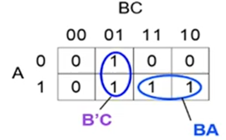
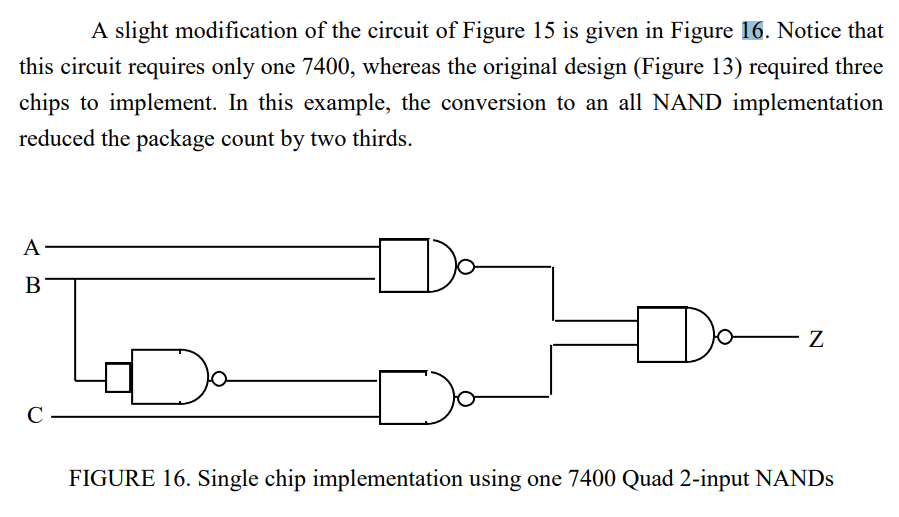
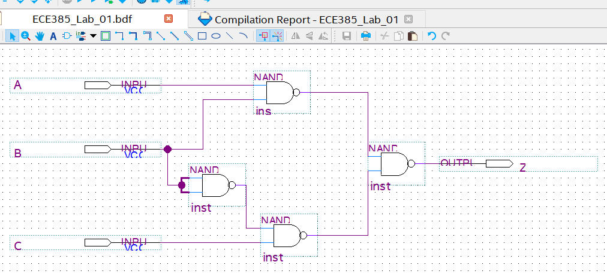
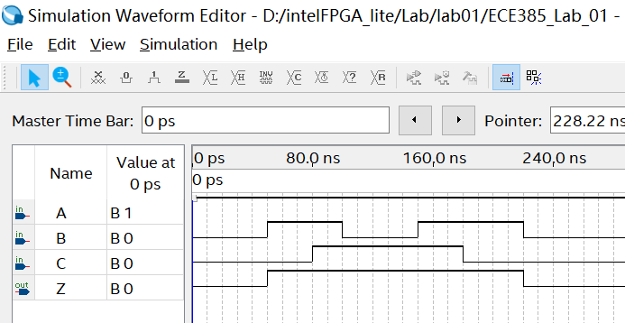
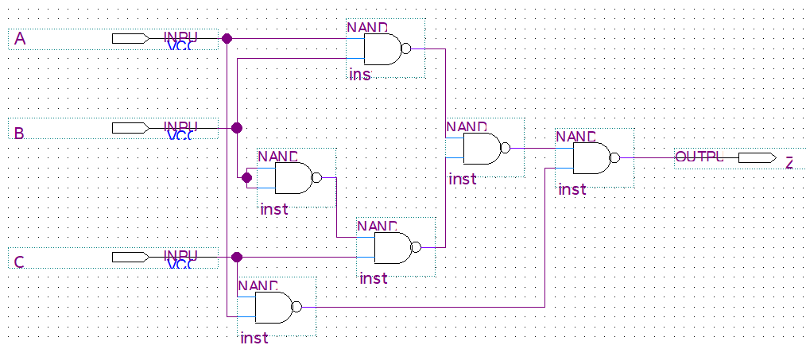
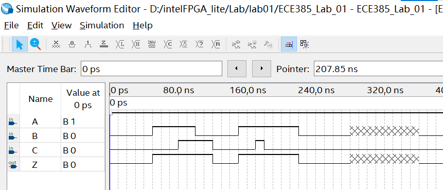

# ECE385 Lab 01

Jie Wang, 3200112404

Jan. 23rd, 2023

> https://mediaspace.illinois.edu/media/1_6ml3gu0u

## Objective

In this lab, we build a 2-to-1 MUX with Quartus Prime Simulation, and understand the static hazards.

Here is the K-map for 2-to-1 MUX, the formula is 
$$
MUX= B'C + BA
$$

## Prelab

### A.       Setup the Quartus. 

Create the project in Quartus, complete the design of the circuit shown in the General Guide, Figure 16 (GG.25) on a Quartus Schematic file. Compile and try the simulation. 

- You will not see the static hazard because in simulation, the gate delay is almost zero.

#### My block diagram for Multiplexer

#### My Waveform 

### B.     Redesign the circuit of part A 

to eliminate all static-1 hazards (glitches) at the output. (For a discussion on glitches, see General Guide part IV – “Design Techniques”, “Delays and Glitches” section GG.22-25). Build the circuit in schematic again. 

## Lab

>  [[LC1\]](#_msoanchor_1)Please check Zuofu’s video and waveforms for more information

1. Unit test each integrated circuit (chip) required for this lab. 
- Since all the chips used in this lab are combinational logic, you may simply verify that each gate within the chip individually implements the truth table as expected. 
- You should also verify that the output for each chip is within the expected noise margin (check the data-sheet for specifics). 
- This means that there should be no ambiguous voltage levels (those which are not clearly logical 0 or logical 1). Ambiguous voltages indicate either a wiring problem (e.g. a bus conflict) or a faulty chip. 
- This should be standard practice with all TTL labs. 

2. Test the circuit of part A of the pre-lab by applying all possible input combinations using the three switches. 
- Complete a truth table of the output as a function of the three inputs.

3. Disconnect the switch going to input B of the circuit in part A. 
- After setting both inputs A and C high, drive input B with a 1 MHz, 0 to 5 volt square wave from the pulse generator.

-  **WARNING:** **You should always check the output of the pulse generator on the oscilloscope before connecting it to the circuit.** **Doing this will greatly reduce the chance of your circuit being smoked by mistake.** 

​      Display input B on one channel of the scope and the circuit output on the other channel. Note that displaying the input is necessary to provide a frame of reference for the output waveform. With the input displayed, it can be seen how the output of the circuit is changing in response to various signals. Save the waveforms (using a USB or Agilent’s screen capturing software on the PC); pay particular attention to the relation between the two waves and the timing. Make sure that voltage and time scales are clearly indicated.

4. Using the three input switches, test the circuit in part B of the pre-lab. 
- Complete a truth table of the output. Does it respond like the circuit of part A? Next, disconnect the switch from input B and hook the pulse generator to input B. With inputs A and C high, observe input B and the circuit output on the oscilloscope.  Describe and save the output and explain any differences between it and the results obtained in part 2. Consider the following question and explain: for the circuit of part A of the pre-lab, at which edge (rising/falling) of the input B are we more likely to observe a glitch at the output?

## POST-LAB

1. Given that the guaranteed minimum propagation delay of a 7400 is 0ns and that its guaranteed maximum delay time is 20ns, complete the timing diagram below for the circuit of part A. (See GG.23 if you are not sure how to proceed.)

